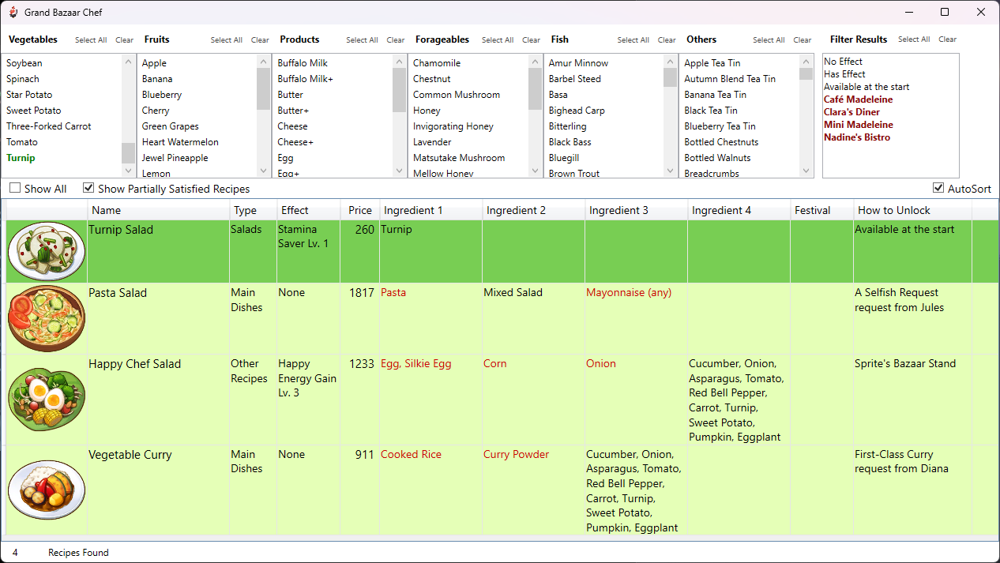

# Grand Bazaar Chef

Grand Bazaar Chef is a WPF desktop application for Windows that helps you discover and manage recipes based on available ingredients. Designed for players who are frustrated with the in game cooking systems, it allows you to quickly find which recipes you can make with your current pantry, explore ingredient categories, and optimize your cooking strategy.

---

## Features

- **Ingredient Selection:** Click to add or remove ingredients from your available list. The recipe results update instantly.
- **Dynamic Recipe Filtering:** Only recipes that can be made with your selected ingredients are shown. Optionally, view partially satisfied Recipes
- **Recipe Details:** Each recipe displays its name, required ingredients, base value, effects, unlock conditions
- **Visuals:** Recipes are shown with images from the game
- **Intermediate Recipes:** The app will consider intermediate recipes you can make as ingredients

## How to Use

1. **Select Ingredients**
   - Browse the ingredient categories on the left.
   - Click an ingredient to add it to your "available" list. Click again to remove it.
   - The recipe list updates in real time to show what you can make.

1. **View Recipes**
   - Recipes that can be fully made with your selected ingredients are highlighted.
   - Optionally, toggle to show partially satisfied recipes
     
1. **Use Exclusions**
   - Apply the exclusion filters to hide groups of recipes you don't want to see (e.g., recipes with certain effects or from certain shops).
     
---
